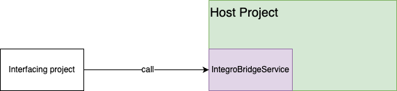

# integroBridgeService
This project allows you to expose Integro ACC as a REST service. It allows you to make calls to Java code.

## Release Notes
The release notes can be found [here](ReleaseNotes.md).

## Implementing The Bridge Service in Your Project
The bridge service can be used in two ways:
* By adding it to the project you want to expose (recommended), 
* By including your project as a dependency to the Bridge cervice deployed.

### Adding the Bridge Service to Your Project
We think it is simplest to the BridgeService dependency to your project. This allows you to only update your code when needed, and you do not need to create a new release/snapshot everytime your project changes.



When starting the bridge service you need to run the following command line:

```
mvn compile exec:java -Dexec.mainClass=MainContainer -Dexec.args="test"
```

##### Installation
The following dependency needs to be added to your pom file:

```
 <dependency>
    <groupId>com.adobe.campaign.tests.service</groupId>
    <artifactId>integroBridgeService</artifactId>
    <version>2.0.2</version>
</dependency>
```

#### Considerations
Since the BridgeService uses Jetty and java Spark, it is quite possible that there maybe conflicts in the project when you add this library. Most importantly you will need to ensure that `javax.servlet` is set to "**compile**" in your maven scope.

We have found it simplest to simply add that library directly in the pom file with the scope "**compile**".

### Including your project in the BridgeService
In this model you can simply add your project as a dependency to the BridgeProject.


When starting the bridge service you need to run the following command line:

```mvn exec:java -Dexec.args="test"```

This will make the service available under :
```http://localhost:8080```

This is a legacy mode of use, and is not that scalable.

## Setting information about your environment
The users accessing bridge service will encounter two different technologies:
* The Bridge Service
* The Host Project

In order to make provide context information the Bridge Service will always let you know which version it is. However, we need to let the users know about the version of the host project. Ths version number can be set by setting the environment property `IBS.PRODUCT.USER.VERSION`.

## Testing That all is Working
All you need to do is to call :
```/test```

If all is good you should get:
```
All systems up - in production
Version : 2.0.0
Product user version : 7.0
```


## Testing That all External Dervices can be Accessed
One of the added values of this service is to create a single point of access for external dependencies. However, this needs to be checked, before using this service. In order to do this you need to the following POST call:

```
/service-check
```

The payload needs to have the following format:

```JSON
{
    "<URL ID 1>": "<dns 1>:<Port>",
    "<URL ID 2>": "<dns 2>:<Port>"
}
```

The payload returns a JSON with the test results:
```JSON
{
    "<URL ID 1>": true,
    "<URL ID 2>": false
}
```

In the example above "<URL ID 2>" is marked as false because it can not be accessed from the BridgeService.

## Making a basic Java Call
The simplest java call is done in the following way:
```/call```

```JSON
{
    "callContent": {
        "<ID>": {
            "class": "<package name>.<class Name>",
            "method": "<method name>",
            "args": ["argument1","argument2"]
        }
    }
}
```

If the IntegroBridgeService can find the method it will execute it. The result is, when successful, is encapsulated in a 'returnValues' object. 

```JSON
{
    "returnValues": {
        "<ID>": "<result>"
    }
}
```

## Call Chaining a basic Java Call
We can chain a series of java calls in the same payload:

```JSON
{
    "callContent": {
        "<ID-1>": {
            "class": "<package name 1>.<class name 1>",
            "method": "<method name 1>",
            "args": ["argument1","argument2"]
        },
        "<ID2->": {
           "class": "<package name 2>.<class name 2>",
           "method": "<method name 2>",
           "args": ["argument1","argument2"]
        }
    }
}
```

In the example above the results will be stored in the following way:

```JSON
{
    "returnValues": {
        "<ID-1>": "<result>",
        "<ID-2>": "<result>"
    }
}
```


### Call Chaining and Call Dependencies
We now have the possibility of injecting call results from one call to the other:

```JSON
{
    "callContent": {
        "<ID-1>": {
            "class": "<package name 1>.<class name 1>",
            "method": "<method name 1>",
            "args": ["argument1","argument2"]
        },
        "<ID-2>": {
           "class": "<package name 2>.<class name 2>",
           "method": "<method name 2>",
           "args": ["<ID-1>","argument2"]
        }
    }
}
```

In the example above "ID-2" will use the return value of the call "ID-1" as ts first argument.

**NOTE** : When passing a call result as an argument, it needs to be a String. In many languages such as JavaScript, the JSON keys need not be a string, however, for this to work you need to pass the ID as a string.  

## Creating a Call Context
We sometimes need to set environment variables when making calls. This is usually indirectly related to the call you are doing. These variable mirror the values of a property file, so they are always treated as strings.

```JSON
{
    "callContent": {
        "<ID>": {
            "class": "<package name>.<class Name>",
            "method": "<method name>",
            "args": ["argument1","argument2"]
        }
    },
    "environmentVariables": {
        "<ENVIRONMENT PROPERTY 1>": "<value>"
    }
}
```

When making the call we first update the environment variables for the system.

This call will use your internal method for setting environment variables. This method can be set by setting the following environment values, when activating the Bridge on your project:
* IBS.ENVVARS.SETTER.CLASS
* IBS.ENVVARS.SETTER.METHOD

## Error Management
Currently, whenever there is an error in the underlying java call we will include the orginal error message in the error response. For example, for the call:

```json
{
    "callContent": {
        "call1": {
            "class": "com.adobe.campaign.tests.integro.tools.RandomManager",
            "method": "getRandomNumber",
            "returnType": "java.lang.String",
            "args": [
                3,
                3
            ]
        }
    }
}
```

We would normally get the error:
```
java.lang.IllegalArgumentException: Minimum number must be strictly inferior than maximum number.
```

When using the bridge service, we also include additional info:

```
Error during call of target Java Class and Method.
We experienced an exception when calling the provided method com.adobe.campaign.tests.integro.tools.RandomManager.getRandomNumber.
Provided error message : 
java.lang.IllegalArgumentException: Minimum number must be strictly inferior than maximum number.
```


## Known Issues and Limitations
As this is a new project there are a few limitations to our solution:
### Cannot call overloaded methods with the same number of arguments.
Today, in order to simply the call model, we have chosen not to specify the argument types in the call. The consequence of this is that in the case of overloaded methods, we only pick the method with the same number of arguments. If two such overloaded methods exist, we choose to throw an exception:
``We could not find a unique method for <method>.`` 

### Only simple arguments
Since this is a REST call we can only correctly manage simple arguments in the payload. One workaround is to use Call Dependencies in Call Chaining (see above). I.e. you can pass simple arguments to one method, and use the complex results of that method as an argument for the following java call.  

### Complex Non-Serialisable Return Objects
In many cases the object a method returns is not rerializable. If that is the case we mine the object, and extract all simple values from the object.

## Building Image
In order to build an image you need to run the following command:
```
docker build -t integrobridgeservice .
```

ARTIFACTORY_USER and ARTIFACTORY_API_TOKEN are locally stored credentials for connecting to your artefactory.

To run the image:

```
docker run --rm -d -p 8080:8080 integrobridgeservice
```

## Existing Images
We currently upload the following versions of the docker image:
### Standard SSL
The current standard version is available here at :

```docker-campaign-qe-snapshot.dr.corp.adobe.com/integrobridgeservice/integro-acc-bridgeservice```

You can run it with: 
```
docker run --rm -d -p 443:8080 -v /root/:/home/app/certificates  docker-campaign-qe-snapshot.dr.corp.adobe.com/integrobridgeservice/integro-acc-bridgeservice
```

The current standard image expects the certificate to be available in the directory `/home/app/certificates`. We solve this by mapping the directory containing the JKS certificate to that directory.

If you want to access the logs you will need to include a mapping of the logs to the host machine. This is done by adding `-v /root/ibs:/home/app/ibs_output`. In this example all logs are store in the local directory `/root/ibs/ibs`.

### Without SSL
The current Non-SSL version is available here at :
```docker-campaign-qe-snapshot.dr.corp.adobe.com/integrobridgeservice/integro-acc-bridgeservice-nossl```

You can run it with:
```
docker run --rm -d -p 443:8080 -v /root/:/home/app/certificates  docker-campaign-qe-snapshot.dr.corp.adobe.com/integrobridgeservice/integro-acc-bridgeservice-nossl
```

The current standard image expects the certificate to be availavle in the directory `/home/app/certificates`. We solve this by mapping the directory containing the JKS certificate to that directory.

If you want to access the logs you will need to include a mapping of the logs to the host machine. This is done by adding `-v /root/ibs:/home/app/ibs_output`. In this example all logs are store in the local directory `/root/ibs/ibs`.

